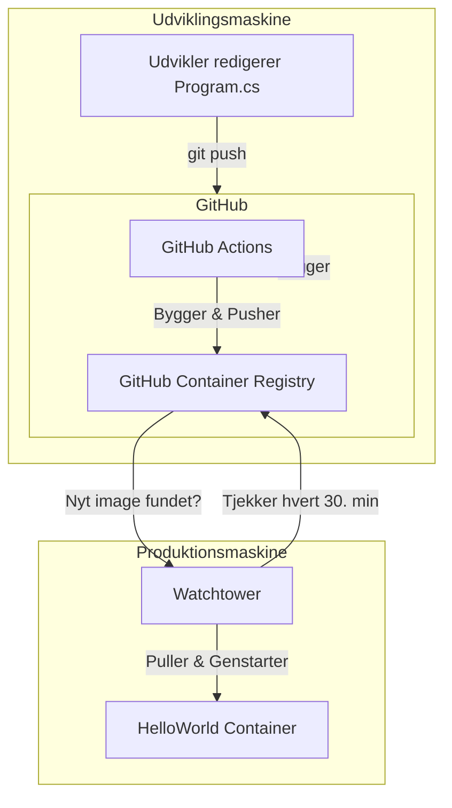

# Guidet øvelse: Hello World C# med Docker, Healthcheck, WatchTower og GitHub Actions

Denne øvelse fører dig trin-for-trin fra et simpelt C# Hello World-projekt til en automatiseret container-opdatering mellem en **udviklingsmaskine** og en **produktionsmaskine**. Dette simulerer et rigtigt CI/CD-flow, hvor du bygger og pusser kode ét sted, og din applikation kører og opdateres et helt andet sted.

---

## Før du starter: Vigtige forudsætninger

Disse trin udføres på din **udviklingsmaskine**.

### 1. GitHub Personal Access Token (PAT)

1. Gå til GitHub **Settings** → **Developer settings** → **Personal access tokens** → **Tokens (classic)**.
2. Klik på **Generate new token (classic)**.
3. Giv den et navn (fx `UCL_Ovelse_To_Maskiner`).
4. Giv scopes: `repo`, `workflow`.
5. Kopiér tokenet.

### 2. Dit GitHub-brugernavn skal være lowercase

### 3. Pakker er Private som standard

---

## Opsætning: To maskiner



---

# DEL 1: Udviklingsmaskinen

## Trin 1: Projekt

```sh
dotnet new console -n HelloWorld
cd HelloWorld
dotnet run
```

## Trin 2: Dockerfile

```dockerfile
FROM mcr.microsoft.com/dotnet/sdk:8.0 AS build
WORKDIR /src
COPY . .
RUN dotnet publish -c Release -o /out

FROM mcr.microsoft.com/dotnet/runtime:8.0 AS runtime
WORKDIR /app
COPY --from=build /out ./
HEALTHCHECK --interval=30s --timeout=3s --retries=3 CMD ["dotnet", "HelloWorld.dll"]
ENTRYPOINT ["dotnet", "HelloWorld.dll"]
```

## Trin 3: Docker Compose

```yaml
services:
  helloworld:
    image: helloworld:latest
    labels:
      com.centurylinklabs.watchtower.enable: "true"
    healthcheck:
      test: ["CMD", "dotnet", "HelloWorld.dll"]
      interval: 30s
      timeout: 3s
      retries: 3
```

## Trin 4: GitHub Actions

```yaml
name: Build and Push Docker image
on:
  push:
    branches: [ "main" ]

jobs:
  build:
    runs-on: ubuntu-latest
    permissions:
      contents: read
      packages: write
    steps:
      - uses: actions/checkout@v4
      - uses: docker/setup-qemu-action@v3
      - uses: docker/setup-buildx-action@v3

      - name: Log in to Container Registry
        uses: docker/login-action@v3
        with:
          registry: ghcr.io
          username: ${{ github.actor }}
          password: ${{ secrets.GITHUB_TOKEN }}

      - name: Build and push Docker image
        uses: docker/build-push-action@v5
        with:
          context: .
          file: ./Dockerfile
          push: true
          platforms: linux/amd64,linux/arm64
          tags: ghcr.io/${{ github.repository_owner }}/helloworld:latest
```

---

# DEL 2: Produktionsmaskinen

```yaml
services:
  helloworld:
    image: ghcr.io/<dit-lille-brugernavn>/helloworld:latest
    restart: unless-stopped
    labels:
      com.centurylinklabs.watchtower.enable: "true"
    healthcheck:
      test: ["CMD", "dotnet", "HelloWorld.dll"]
      interval: 30s
      timeout: 3s
      retries: 3

  watchtower:
    image: containrrr/watchtower
    restart: unless-stopped
    volumes:
      - /var/run/docker.sock:/var/run/docker.sock
    environment:
      WATCHTOWER_POLL_INTERVAL: 1800
      WATCHTOWER_CLEANUP: "true"
    command: --label-enable
```

---

# DEL 3: Verificering

```csharp
Console.WriteLine("Hej fra produktion! Opdateret via WatchTower!");
```

```sh
git add .
git commit -m "opdateret"
git push
```

---

# Ekstra

Gentag med webprojekt.

---

# Refleksionsspørgsmål

* Hvorfor adskille miljøer?
* Hvad behøver produktion ikke?
* Hvad er broen mellem maskinerne?
* Hvad hvis Watchtower dør?
* Fordele ved GHCR?
* Hvordan for kritiske systemer?
* Hvordan standardisere workflows?
