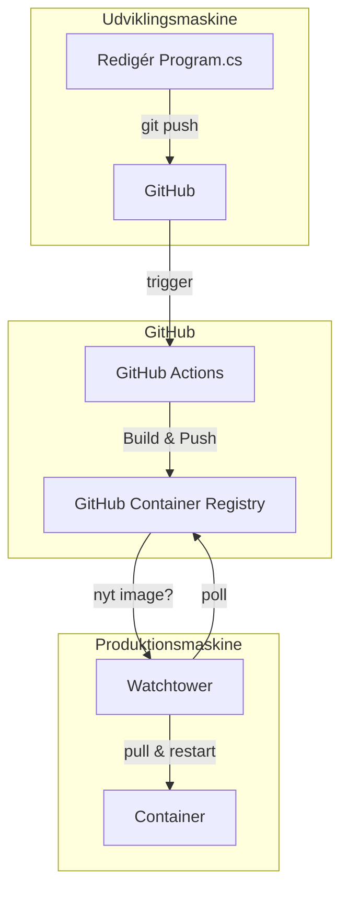

<!-- metadata: { area: "intro", purpose: "Overordnet mål og kontekst", audience: "Studerende på Datamatiker", difficulty: "Let" } -->
# Guidet øvelse: Hello World C# → CI/CD med Docker, Healthcheck, Watchtower og GitHub Actions (opdateret)

Denne version er opdateret ud fra feedback: **ingen PAT nødvendig**, bedre håndtering af **lowercase brugernavne** til GHCR, **beginner vs. advanced** workflows, **main/master**-tip, og mulighed for **web/Blazor** i stedet for ren terminal. Alt er gjort mere guidet, skridt‑for‑skridt.

---

<!-- metadata: { area: "forudsætninger", purpose: "Forklarer krav før øvelsen", audience: "Studerende", difficulty: "Let" } -->
## Før du starter: Vigtige forudsætninger

- **Ingen PAT nødvendig.** GitHub Actions bruger automatisk `GITHUB_TOKEN` til at bygge og **pushe til GHCR** i *samme* bruger/org. Du skal derfor **ikke** oprette en PAT i denne øvelse. (PAT er kun relevant, hvis du pusher til **et andet registry** eller **en andens** repo/namespace.)
- Sørg for at have **Git**, **.NET SDK 8** og **Docker Desktop** installeret på udviklingsmaskinen.

---

<!-- metadata: { area: "arkitektur", purpose: "Forstå to-maskine-setup", audience: "Studerende", difficulty: "Let" } -->
## Opsætning: To maskiner (Fabrik → Udstillingsvindue)

- **Udviklingsmaskine (Fabrikken):** du skriver kode, commit’er og pusher.
- **GitHub Actions:** bygger image og pusher til **GHCR**.
- **Produktionsmaskine (Udstillingsvinduet):** kører containeren og opdateres automatisk via **Watchtower**.



---

<!-- metadata: { area: "udvikling", purpose: "Opsætning af udviklingsmiljø", audience: "Studerende", difficulty: "Middel" } -->
# DEL 1: Udviklingsmaskinen (Fabrikken)

## Trin 1: Opret Hello World (Console) – eller vælg Web (valgfrit)

**Console‑app (hurtigst):**
```sh
dotnet new console -n HelloWorld
cd HelloWorld
```
`Program.cs` kan være fx:
```csharp
Console.WriteLine("Hello from CI/CD!");
```

**Web/Blazor (anbefalet til eksamensprojekter, valgfrit):**
```sh
dotnet new web -n HelloWorld.Web
cd HelloWorld.Web
```
Tilføj et simpelt endpoint i `Program.cs`:
```csharp
var app = WebApplication.CreateBuilder(args).Build();
app.MapGet("/", () => "Hello from production!");
app.MapGet("/healthz", () => Results.Ok("OK"));
app.Run();
```

## Trin 2: Dockerfile

**Console‑app:**
```dockerfile
# build
FROM mcr.microsoft.com/dotnet/sdk:8.0 AS build
WORKDIR /src
COPY . .
RUN dotnet publish -c Release -o /out

# runtime
FROM mcr.microsoft.com/dotnet/runtime:8.0
WORKDIR /app
COPY --from=build /out ./
HEALTHCHECK --interval=30s --timeout=3s --retries=3 CMD ["dotnet", "HelloWorld.dll"]
ENTRYPOINT ["dotnet", "HelloWorld.dll"]
```

**Web‑app (valgfri):**
```dockerfile
# build
FROM mcr.microsoft.com/dotnet/sdk:8.0 AS build
WORKDIR /src
COPY . .
RUN dotnet publish -c Release -o /out

# runtime
FROM mcr.microsoft.com/dotnet/aspnet:8.0
WORKDIR /app
COPY --from=build /out ./
EXPOSE 8080
ENV ASPNETCORE_URLS=http://+:8080
HEALTHCHECK --interval=30s --timeout=3s --retries=3 CMD curl -fsS http://localhost:8080/healthz || exit 1
ENTRYPOINT ["dotnet", "HelloWorld.Web.dll"]
```

## Trin 3: (Valgfrit) Lokal test
```sh
docker build -t helloworld:latest .
docker run --rm -p 8080:8080 helloworld:latest
```

## Trin 4: GitHub Actions – Sådan gør du helt konkret

### 4.1 Opret GitHub‑repo og push
1) Gå til **github.com** → **New** → navn fx `HelloWorld-Docker-Watchtower` → vælg **Public** → **Create**.

**Lokalt med Git:**
```sh
git init
git add .
git commit -m "init"
git branch -M main
# Brug master hvis din Git default er master
# git branch -M master

git remote add origin https://github.com/<dit-brugernavn>/<dit-repo>.git
git push -u origin main
# eller: git push -u origin master
```

**Alternativt upload manuelt:** i repoet → **Add file** → **Upload files** → **Commit**.

### 4.2 Opret workflow‑fil
I repoet → **Actions** → **New workflow** → *set up a workflow yourself* → opret `.github/workflows/docker-publish.yml` og indsæt **Begynder**‑ eller **Avanceret**‑versionen herunder.

**Vigtigt om GHCR og brugernavne:** GHCR kræver **lowercase** i image‑navne. Vi sætter en miljøvariabel `OWNER_LC` via Bash, så store bogstaver bliver til små.

#### A) Beginner‑workflow (enkel, én platform)
```yaml
name: Build and Push Docker image
on:
  push:
    branches: [ "main", "master" ]

permissions:
  contents: read
  packages: write

jobs:
  build:
    runs-on: ubuntu-latest
    steps:
      - name: Checkout
        uses: actions/checkout@v5

      - name: Set lowercase owner
        shell: bash
        run: |
          echo "OWNER_LC=${GITHUB_REPOSITORY_OWNER@L}" >> $GITHUB_ENV

      - name: Log in to GHCR
        uses: docker/login-action@v3
        with:
          registry: ghcr.io
          username: ${{ github.actor }}
          password: ${{ secrets.GITHUB_TOKEN }}

      - name: Build & Push (single platform)
        uses: docker/build-push-action@v5
        with:
          context: .
          file: ./Dockerfile
          push: true
          tags: ghcr.io/${{ env.OWNER_LC }}/helloworld:latest
```

#### B) Avanceret‑workflow (multiplatform AMD64+ARM64)
```yaml
name: Build and Push Docker image (multi)
on:
  push:
    branches: [ "main", "master" ]

permissions:
  contents: read
  packages: write

jobs:
  build:
    runs-on: ubuntu-latest
    steps:
      - name: Checkout
        uses: actions/checkout@v5

      - name: Set lowercase owner
        shell: bash
        run: |
          echo "OWNER_LC=${GITHUB_REPOSITORY_OWNER@L}" >> $GITHUB_ENV

      - name: Set up QEMU
        uses: docker/setup-qemu-action@v3

      - name: Set up Buildx
        uses: docker/setup-buildx-action@v3

      - name: Log in to GHCR
        uses: docker/login-action@v3
        with:
          registry: ghcr.io
          username: ${{ github.actor }}
          password: ${{ secrets.GITHUB_TOKEN }}

      - name: Build & Push (multi-platform)
        uses: docker/build-push-action@v5
        with:
          context: .
          file: ./Dockerfile
          push: true
          platforms: linux/amd64,linux/arm64
          tags: ghcr.io/${{ env.OWNER_LC }}/helloworld:latest
```

### 4.3 Gør pakken public i GHCR (vigtigt)
- I repoet: venstre menu **Packages** → vælg pakken **helloworld** → **Package settings** → **Visibility: Public**.

---

<!-- metadata: { area: "produktion", purpose: "Opsætning af produktion", audience: "Studerende", difficulty: "Middel" } -->
# DEL 2: Produktionsmaskinen (Udstillingsvinduet)

Opret en mappe på produktionsmaskinen (fx `~/production-app`) og læg denne `docker-compose.yml` ind:

**Console‑container + Watchtower:**
```yaml
services:
  helloworld:
    image: ghcr.io/<dit-lille-brugernavn>/helloworld:latest
    restart: unless-stopped
    labels:
      com.centurylinklabs.watchtower.enable: "true"
    healthcheck:
      test: ["CMD", "dotnet", "HelloWorld.dll"]
      interval: 30s
      timeout: 3s
      retries: 3

  watchtower:
    image: containrrr/watchtower
    restart: unless-stopped
    volumes:
      - /var/run/docker.sock:/var/run/docker.sock
    environment:
      WATCHTOWER_POLL_INTERVAL: 1800
      WATCHTOWER_CLEANUP: "true"
    command: --label-enable
```

**Web/Blazor‑container (valgfri) + Watchtower:**
```yaml
services:
  web:
    image: ghcr.io/<dit-lille-brugernavn>/helloworld:latest
    restart: unless-stopped
    ports:
      - "8080:8080"
    labels:
      com.centurylinklabs.watchtower.enable: "true"
    healthcheck:
      test: ["CMD", "curl", "-fsS", "http://localhost:8080/healthz"]
      interval: 30s
      timeout: 3s
      retries: 3

  watchtower:
    image: containrrr/watchtower
    restart: unless-stopped
    volumes:
      - /var/run/docker.sock:/var/run/docker.sock
    environment:
      WATCHTOWER_POLL_INTERVAL: 1800
      WATCHTOWER_CLEANUP: "true"
    command: --label-enable
```

Start:
```sh
docker compose up -d
```

---

<!-- metadata: { area: "verifikation", purpose: "Test af pipeline", audience: "Studerende", difficulty: "Let" } -->
# DEL 3: Verificering af flowet

Lav en lille ændring og push:
```csharp
// Console
Console.WriteLine("Hej fra produktion! Opdateret via Watchtower!");
```
```sh
git add .
git commit -m "feat: opdater besked"
git push
```

Se logs på produktion:
```sh
docker ps
# find container-navn
docker logs <container-navn>
```
For web‑varianten: åbn `http://<server>:8080/` og `http://<server>:8080/healthz`.

---

<!-- metadata: { area: "fejlfinding", purpose: "Hjælper med kendte fejl", audience: "Studerende", difficulty: "Let" } -->
## Fejlfinding (typiske fejl)

- **Workflow trigges ikke** → din branch hedder måske `master` i stedet for `main`. Workflow’et lytter på **begge**: `branches: ["main", "master"]`.
- **Push til GHCR fejler** → sørg for at pakken er **Public** (Package settings).
- **Image‑navn/Owner med store bogstaver** → workflows sætter `OWNER_LC` automatisk til lowercase.
- **PAT mangler?** → ikke i denne øvelse. `GITHUB_TOKEN` er nok.
- **Healthcheck fejler i web** → tjek at `ASPNETCORE_URLS` og `/healthz` endpoint findes.

---

<!-- metadata: { area: "udfordring", purpose: "Udvidet opgave", audience: "Studerende", difficulty: "Svær" } -->
## Ekstra udfordring (valgfri)
- Skift fra console til web og lav **HTTP‑healthcheck**.
- Indfør **version‑tags** (`:v1`, `:v1.1`) og pin i produktion.
- Tilføj **planned maintenance** (pause Watchtower, opdater manuelt, genaktivér).

---

<!-- metadata: { area: "refleksion", purpose: "Læring og forståelse", audience: "Studerende", difficulty: "Let" } -->
## Refleksionsspørgsmål
- Hvorfor adskille udviklings‑ og produktionsmiljøer?
- Hvilke filer behøver produktionsmaskinen ikke? Hvorfor?
- Hvad er broen mellem de to maskiner i denne øvelse?
- Hvad sker der, hvis Watchtower går ned?
- Hvad vinder vi ved GHCR som public registry?
- Hvordan ville du ændre setup’et for et kritisk system (vinduer, version‑pinning)?
- Hvordan standardiserer vi workflows i større teams (code owners, reviews, version‑tags)?
